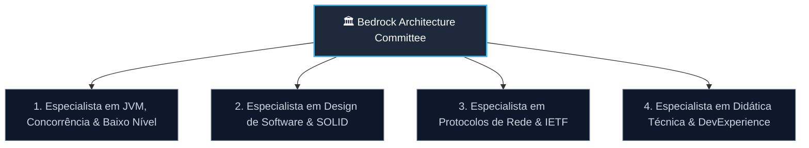

# 🏛️ Comitê de Avaliação Arquitetural (Bedrock Architecture Committee)

O **Comitê de Avaliação Arquitetural do Bedrock Java Framework** é o órgão consultivo e normativo responsável por garantir a integridade pedagógica, a excelência de engenharia e a soberania técnica do projeto.

Como o Bedrock não visa competir com frameworks corporativos de alta produtividade (como Spring Boot ou Quarkus), sua missão é **pedagógica e fundamental**: desmistificar a "física do motor" da JVM, de protocolos de rede e de padrões de arquitetura de software, mantendo uma política rígida de **Zero Dependências Externas** no seu núcleo (`bedrock-core`).

---

## 👥 Estrutura das Cadeiras de Especialistas

O comitê é composto por 4 cadeiras técnicas independentes. Nenhuma decisão arquitetural ou nova versão é aprovada sem o parecer favorável de cada perspectiva:

---

### 1. Cadeira de JVM, Concorrência e Baixo Nível
* **Responsabilidade:** Avaliar a eficiência do modelo de execução, alocação de memória na Heap, uso de I/O não bloqueante (`java.nio`), segurança de threads (`Thread Safety`) e aproveitamento das inovações do Java moderno (Java 21+, Project Loom / Virtual Threads).
* **Diretriz Central:** Evitar construções que causem *Carrier Thread Pinning* (como blocos `synchronized` protegendo operações de I/O de rede ou disco) e garantir que recursos de sistema (`SocketChannel`, `Connection`, `ResultSet`) utilizem estritamente `try-with-resources` e buffers reciclados.
* **Bibliografia e Especificações Canônicas:**
  * **GOETZ, Brian et al.** *Java Concurrency in Practice*. Addison-Wesley, 2006. (Foco em: Imutabilidade, thread confinement, locks explícitos `ReentrantLock` vs. monitores intrínsecos).
  * **LINDHOLM, Tim et al.** *The Java Virtual Machine Specification (Java SE 21 Edition)*. Oracle Corporation. (Foco em: Bytecode execution, frames de pilha, memory model JMM e especificações de tipos).
  * **OPENJDK.** *JEP 444: Virtual Threads*. (Foco em: Mecânica de montagem/desmontagem de threads virtuais sobre carrier threads do ForkJoinPool).
  * **OPENJDK.** *JEP 453: Structured Concurrency* e *JEP 446: Scoped Values*. (Foco em: Coordenação de tarefas concorrentes com tempo de vida delimitado).

---

### 2. Cadeira de Design de Software & Padrões Arquiteturais
* **Responsabilidade:** Avaliar a modelagem de classes, contratos de interface, desacoplamento entre camadas (Controller, Service, Repository) e aderência estrita aos princípios SOLID, com ênfase na Inversão de Dependência (SOLID 'D').
* **Diretriz Central:** Rejeitar "acoplamentos acidentais" e código espaguete. Promover registros explícitos e composição sobre herança. O container IoC deve instanciar dependências por ordem topológica sem depender de auto-scan cego.
* **Bibliografia Canônica:**
  * **GAMMA, Erich; HELM, Richard; JOHNSON, Ralph; VLISSIDES, John.** *Design Patterns: Elements of Reusable Object-Oriented Software* (GoF). Addison-Wesley, 1994. (Foco em: Singleton, Factory, Template Method, Observer, Strategy).
  * **MARTIN, Robert C. (Uncle Bob).** *Clean Architecture: A Craftsman's Guide to Software Structure and Design*. Prentice Hall, 2017. (Foco em: Dependency Inversion Principle, Separation of Concerns, fronteiras arquiteturais).
  * **BLOCH, Joshua.** *Effective Java (3rd Edition)*. Addison-Wesley, 2018. (Foco em: Item 1: Static factory methods; Item 15: Minimize accessibility; Item 17: Minimize mutability; Item 51: Design method signatures carefully; Item 64: Refer to objects by their interfaces).
  * **FOWLER, Martin.** *Patterns of Enterprise Application Architecture (P of EAA)*. Addison-Wesley, 2002. (Foco em: Repository Pattern, Data Mapper vs. Active Record, Registry).

---

### 3. Cadeira de Protocolos de Rede & Padrões IETF
* **Responsabilidade:** Garantir conformidade rigorosa com as especificações da Internet Engineering Task Force (IETF) e do W3C para comunicação de rede (TCP/IP, HTTP/1.1, WebSockets e TLS).
* **Diretriz Central:** Não inventar protocolos proprietários nem ignorar detalhes de segurança de especificações abertas (ex: obrigatoriedade do desmascaramento XOR em frames vindos do cliente no WebSocket; RFC 7807 para respostas de erro de API).
* **Especificações e Bibliografia Canônicas:**
  * **IETF RFC 6455:** *The WebSocket Protocol* (Fette & Melnikov, 2011). (Foco em: §1.3 Opening Handshake, §5.1 Framing Architecture, §5.2 Base Framing Protocol, §5.3 Client-to-Server Masking).
  * **IETF RFC 9110 / RFC 9112:** *HTTP Semantics* e *HTTP/1.1*. (Foco em: Métodos idempotentes vs. não-idempotentes, headers de negociação `Upgrade`, códigos de status 1xx, 2xx, 4xx e 5xx).
  * **IETF RFC 7807 / RFC 9457:** *Problem Details for HTTP APIs*. (Foco em: Padronização semântica do JSON de erros de domínio e validação).
  * **IETF RFC 7519:** *JSON Web Token (JWT)*. (Foco para a v3.0: Estrutura JWS, algoritmos HMAC-SHA256 e parsing de claims).
  * **KUROSE, James; ROSS, Keith.** *Computer Networking: A Top-Down Approach (8th Edition)*. Pearson, 2020. (Foco em: Camada de Aplicação, TCP Socket Programming, Handshake de 3 vias e fluxo de buffers).

---

### 4. Cadeira de Didática Técnica & DevExperience (Guardião da "Zero Mágica")
* **Responsabilidade:** Defender incansavelmente a clareza e a transparência do código para quem está aprendendo. Impedir que o framework se torne uma "caixa-preta" inescrutável.
* **Diretriz Central:** Se um estudante abrir uma classe do Bedrock e der `Ctrl+Clique` nos métodos, ele deve conseguir rastrear o fluxo em menos de 100 linhas de código limpo. Comentários `🎓 BEDROCK TUTORIAL` devem obrigatoriamente explicar o "porquê" das decisões de baixo nível e conectar a teoria à prática.
* **Bibliografia e Filosofia de Design:**
  * **OUSTERHOUT, John.** *A Philosophy of Software Design*. Yaknyam Press, 2018. (Foco em: "Deep Modules" — interfaces simples que escondem complexidade sem obscurecer o comportamento; combate à complexidade artificial).
  * **FEATHERS, Michael.** *Working Effectively with Legacy Code*. Prentice Hall, 2004. (Foco em: Testabilidade intrínseca, eliminação de dependências ocultas e *seams* no código).
  * **BROWN, Simon.** *Software Architecture for Developers*. Leanpub. (Foco em: Modelo C4, comunicação visual e clareza de diagramas de arquitetura).

---

## 📋 Protocolo de Revisão do Comitê (Review Checklist)

Antes de qualquer pull request ou nova versão do Bedrock ser aceita no repositório, ela deve ser avaliada contra este checklist:

| Critério | Cadeira Responsável | Perguntas de Verificação |
| :--- | :---: | :--- |
| **Zero External Deps** | JVM / Baixo Nível | O `bedrock-core/pom.xml` permaneceu limpo de dependências externas? |
| **Carrier Thread Safety** | JVM / Baixo Nível | Alguma chamada bloqueante ocorre dentro de blocos `synchronized` que travariam o worker thread do Loom? Usamos `ReentrantLock`? |
| **SOLID & Abstração** | Design & SOLID | Os novos serviços dependem de interfaces (`app.bind`)? Os componentes são testáveis unitariamente com classes puras? |
| **Conformidade IETF** | Protocolos & Redes | O código segue a RFC oficial à risca (códigos de status, cabeçalhos, manipulação de bits/bytes)? |
| **Transparência Pedagógica** | Didática & DX | Há anotações com comportamento oculto? O fluxo pode ser seguido sem bytecode gerado em runtime? Há comentários `🎓 BEDROCK TUTORIAL`? |
| **Cobertura e Regressão** | Todas | Todos os testes existentes continuam passando? Há testes unitários e de integração validando casos extremos e vetores oficiais? |

---

## 📂 Registro de Decisões de Arquitetura (ADRs)

Todas as grandes escolhas técnicas do Bedrock são registradas no diretório [`docs/adr/`](./adr/) acompanhadas das justificativas do Comitê e das citações bibliográficas correspondentes.
